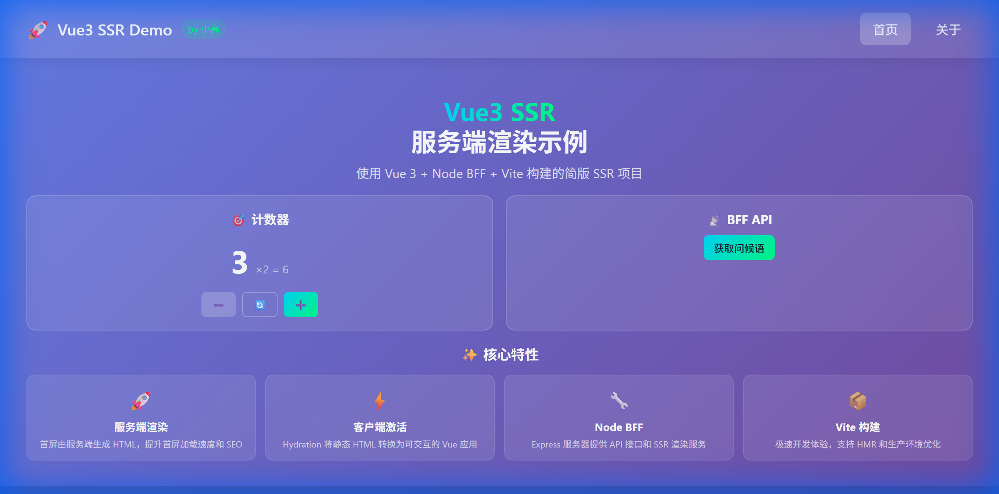
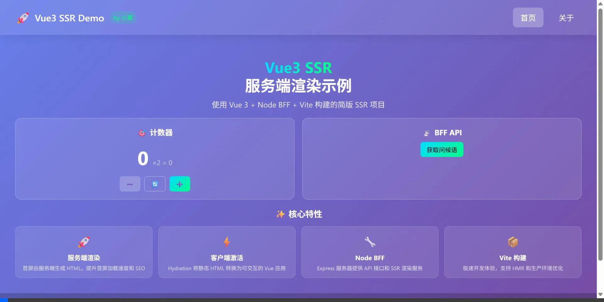

# Vue3 SSR Demo

<p align="center">
  
  
  
  
</p>

<p align="center">
  一个使用 <strong>Vue 3 + Node BFF + Vite</strong> 构建的简版服务端渲染（SSR）示例项目
</p>

<p align="center">
  <strong>作者：小高</strong>
</p>

---

## 📸 项目预览

### 首页截图



### 功能演示



---

## ✨ 特性

| 特性              | 说明                            |
| ----------------- | ------------------------------- |
| 🚀 **服务端渲染** | 首屏由服务端生成 HTML，SEO 友好 |
| ⚡ **客户端激活** | Hydration 无缝接管交互          |
| 🔧 **Node BFF**   | Express 提供 API 和渲染         |
| 📦 **Vite 构建**  | 极速 HMR 开发体验               |
| 🗄️ **Pinia**      | 状态服务端预取 + 客户端还原     |

---

## 🚀 快速开始

```bash
# 克隆项目
git clone https://github.com/xiaogao/vue3-ssr-demo.git
cd vue3-ssr-demo

# 安装依赖
npm install

# 开发模式
npm run dev

# 访问 http://localhost:3000
```

## 📦 生产构建

```bash
npm run build    # 构建
npm run serve    # 启动生产服务器
```

---

## 📁 项目结构

```
vue3-ssr-demo/
├── index.html           # HTML 模板
├── package.json         # 项目配置
├── vite.config.js       # Vite 配置
├── server.js            # Node BFF 服务器
├── assets/              # 静态资源
└── src/
    ├── main.js          # 应用工厂
    ├── entry-client.js  # 客户端入口
    ├── entry-server.js  # 服务端入口
    ├── App.vue          # 根组件
    ├── router/          # 路由
    ├── stores/          # Pinia 状态
    └── pages/           # 页面组件
```

---

## 🔗 API 接口

| 接口             | 说明         |
| ---------------- | ------------ |
| `GET /api/hello` | 问候语接口   |
| `GET /api/users` | 用户列表接口 |

---

## 📖 SSR 工作原理

```
浏览器请求 → Node 服务器(Express)
                ↓
         Vue SSR 渲染组件
                ↓
         生成完整 HTML + 初始状态
                ↓
         返回给浏览器显示
                ↓
         客户端 JS 加载
                ↓
         Hydration 激活交互
```

---

## 🛠️ 技术栈

- **Vue 3** - 渐进式 JavaScript 框架
- **Vue Router 4** - 官方路由
- **Pinia** - 状态管理
- **Vite 5** - 下一代构建工具
- **Express** - Node.js Web 框架

---

## 📄 开源协议

[MIT License](./LICENSE) © 2026 小高

---

<p align="center">
  如果这个项目对你有帮助，欢迎 ⭐ Star！
</p>
